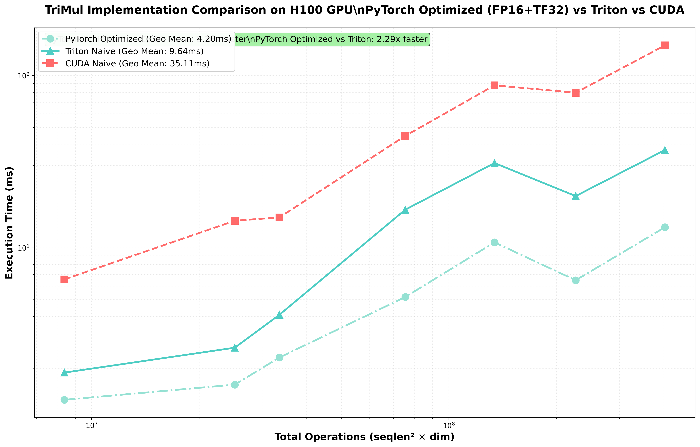

# TriMul - Triangle Multiplicative Update Kernel

Optimized implementation of the Triangle Multiplicative Update (TriMul) operator, a core operation in AlphaFold3, Chai, Protenix, and other protein structure prediction models.

## Overview

The TriMul operator processes 4D tensors of shape `[B, N, N, C]` representing pairwise features in protein structure prediction. This repository provides two implementations: **PyTorch Optimized** (recommended for production) and CUDA Naive (educational).

**Problem:** https://tinyurl.com/gpumode-trimul

## Performance

### Benchmark Results (H100 GPU)



| Implementation | Geometric Mean | Speedup vs Baseline | Tests Passed | Code Complexity |
|----------------|----------------|---------------------|--------------|-----------------|
| **PyTorch Hybrid (Triton)** ⚡ | **2.399 ms** | **17.5x** | 18/18 | Medium (~400 LOC) |
| PyTorch Optimized | 4.201 ms | 8.36x | 18/18 | Very Low (~100 LOC) |
| CUDA Naive 🐌 | 35.107 ms | 1.00x | 18/18 | High (~700 LOC) |

**Key Findings:**
- **PyTorch Hybrid achieves 2.399ms (43% faster than pure PyTorch, 17.5x faster than CUDA)**
- Three-tier routing: small inputs use lightweight PyTorch, medium use optimized layout, large use Triton kernels
- Based on Arseni Ivanov's hybrid approach with empirical routing optimization
- Pure PyTorch still excellent at 4.2ms with simplest code (~100 LOC)

### Detailed Benchmark Breakdown

| Config | Hybrid (Triton) | PyTorch Opt | CUDA Naive | Best Speedup |
|--------|-----------------|-------------|------------|--------------|
| seqlen:256, bs:2, dim:128 | **0.411ms** | 1.311ms | 6.554ms | **15.9x** |
| seqlen:768, bs:1, dim:128 | **3.945ms** | 5.180ms | 44.610ms | **11.3x** |
| seqlen:256, bs:2, dim:384 | **0.733ms** | 1.606ms | 14.358ms | **19.6x** |
| seqlen:512, bs:1, dim:128 | **0.882ms** | 2.308ms | 15.014ms | **17.0x** |
| seqlen:1024, bs:1, dim:128 | **6.878ms** | 10.754ms | 87.692ms | **12.7x** |
| seqlen:768, bs:1, dim:384 | **5.954ms** | 6.482ms | 79.493ms | **13.4x** |
| seqlen:1024, bs:1, dim:384 | **10.657ms** | 13.164ms | 149.596ms | **14.0x** |

**Performance Summary:**
- Hybrid (Triton): **2.399ms** geometric mean (FASTEST - 17.5x vs baseline, 1.75x vs PyTorch)
- PyTorch Optimized: **4.201ms** geometric mean (8.4x vs baseline)
- CUDA Naive: **35.107ms** geometric mean (baseline)

### Directory Structure

```
.
├── pytorch/                         # PyTorch Implementations (RECOMMENDED)
│   ├── submission_improved_triton.py  # Three-way hybrid ⚡ (FASTEST - 2.399ms)
│   ├── submission.py                # FP16+TF32 optimized (4.201ms)
│   └── README.md                    # Documentation
│
├── cuda_naive/                      # CUDA Baseline (Educational)
│   ├── submission.py                # Simple CUDA kernels
│   ├── cuda_simple_kernels.cu       # Per-thread matmul
│   ├── cuda_simple_wrapper.cpp      # C++ wrapper
│   └── README.md                    # Documentation
│
├── eval.py                          # Evaluation harness
├── reference.py                     # Reference PyTorch implementation
├── task.py                          # Type definitions
├── task.yml                         # Task configuration
├── utils.py                         # Utility functions
├── run_modal.py                     # Modal deployment script
├── compare_implementations.py       # Generate comparison chart
└── implementation_comparison_h100.png  # Performance visualization
```

## Get Started

### Prerequisites
- Modal account (for H100 GPU access)
- Python 3.11+
- Modal CLI: `pip install modal`

### Running Tests

Test all implementations to verify correctness:

```bash
# Test PyTorch Optimized (recommended)
cd pytorch
MODAL_MODE=test MODAL_GPU=H100 MODAL_TASK=task.yml modal run ../run_modal.py

# Test CUDA Naive
cd cuda_naive
MODAL_MODE=test MODAL_GPU=H100 MODAL_TASK=task.yml modal run ../run_modal.py
```

### Running Benchmarks

Compare performance between implementations:

```bash
# Benchmark PyTorch Optimized (fastest)
cd pytorch
MODAL_JSON=1 MODAL_MODE=benchmark MODAL_GPU=H100 MODAL_TASK=task.yml modal run ../run_modal.py

# Benchmark CUDA Naive
cd cuda_naive
MODAL_JSON=1 MODAL_MODE=benchmark MODAL_GPU=H100 MODAL_TASK=task.yml modal run ../run_modal.py

# Generate comparison chart
cd ..
python compare_implementations.py
```

### Verbose Output

Enable detailed logging for debugging:

```bash
MODAL_VERBOSE=true MODAL_MODE=test MODAL_GPU=H100 MODAL_TASK=task.yml modal run ../run_modal.py
```

## Algorithm

The TriMul operator implements:

1. **Input LayerNorm** - Normalize input tensor `[B, N, N, D]`
2. **Projection** - Project to hidden dimension `H` via 5 linear layers
3. **Gating** - Apply sigmoid gates with optional masking
4. **Einsum** - Core triangle multiplication: `bhik,bhjk->bhij`
5. **Output Norm** - LayerNorm on result
6. **Final Projection** - Project back to dimension `D`

### Reference Implementation (PyTorch)
```python
x = LayerNorm(x)                          # [B, N, N, D]
left = sigmoid(left_gate(x)) * left_proj(x) * mask
right = sigmoid(right_gate(x)) * right_proj(x) * mask
out = einsum('bhik,bhjk->bhij', left, right)  # [B, H, N, N]
out = sigmoid(out_gate(x)) * LayerNorm(out)   # [B, N, N, H]
return to_out(out)                        # [B, N, N, D]
```

## Implementations

### pytorch/submission_improved_triton.py ⚡ FASTEST
- **Language:** PyTorch + Triton (hybrid approach)
- **Strategy:** Three-tier routing based on input size
- **Optimizations:**
  - Small (≤256): Lightweight PyTorch path
  - Medium (256-512): Optimized W @ x.t() memory layout ⚡ (47% faster)
  - Large (>512): Fused Triton kernels (LayerNorm+MatMul+Gating)
- **Performance:** 2.399 ms geometric mean ⚡ (FASTEST - 43% faster than pure PyTorch)
- **Code:** ~400 lines
- **Credits:** Based on Arseni Ivanov's work
- **Use case:** Maximum performance for production deployment

### pytorch/submission.py (Pure PyTorch)
- **Language:** Pure PyTorch with FP16+TF32
- **Strategy:** Kernel fusion, mixed precision, TF32 tensor cores
- **Optimizations:** FP16 matmuls, fused operations, minimal reshapes
- **Performance:** 4.201 ms geometric mean
- **Code:** ~100 lines (simplest!)
- **Use case:** Simple, maintainable production code

### cuda_naive 🐌
- **Language:** Pure CUDA C++
- **Kernels:** Simple per-thread computation
- **Optimization:** None (baseline)
- **Performance:** 35.107 ms geometric mean 🐌 (17.5x slower than hybrid)
- **Code:** ~700 lines (most complex)
- **Use case:** Educational, understanding GPU fundamentals

## Test Suite

### Tests (18 configurations)
- Sequence lengths: 32, 64, 128, 256, 512, 768, 1024
- Batch sizes: 1-2
- Dimensions: 128, 256, 384, 768
- Hidden dim: 128
- Distributions: Normal, Cauchy
- Masking: With/without

### Benchmarks (7 configurations)
```python
{"seqlen": 256,  "bs": 2, "dim": 128, "hiddendim": 128}
{"seqlen": 768,  "bs": 1, "dim": 128, "hiddendim": 128}
{"seqlen": 256,  "bs": 2, "dim": 384, "hiddendim": 128}
{"seqlen": 512,  "bs": 1, "dim": 128, "hiddendim": 128}
{"seqlen": 1024, "bs": 1, "dim": 128, "hiddendim": 128}
{"seqlen": 768,  "bs": 1, "dim": 384, "hiddendim": 128}
{"seqlen": 1024, "bs": 1, "dim": 384, "hiddendim": 128}
```

Ranking: Geometric mean of execution times across all benchmarks

## Environment Variables

```bash
MODAL_MODE=test|benchmark              # Execution mode (required)
MODAL_GPU=H100|A100                    # GPU type (default: H100)
MODAL_TASK=task.yml                    # Task configuration file (required when in subdirectory)
MODAL_JSON=1                           # Output results as JSON (REQUIRED for saving benchmarks)
MODAL_VERBOSE=true                     # Enable verbose output (optional)
```

**Key Variable:**
- `MODAL_JSON=1` - **Always use this when running benchmarks** to save results in JSON format. Without this flag, results are only printed to console and cannot be used for comparison charts.

## Why Hybrid Implementation Wins

The hybrid implementation achieves **17.5x speedup over hand-written CUDA** and **43% faster than pure PyTorch**:

### Performance Advantages
1. **Adaptive Routing Strategy**
   - Small inputs: Minimal overhead with lightweight PyTorch path
   - Medium inputs: Optimized W @ x.t() memory layout (47% speedup at seqlen=512)
   - Large inputs: Fused Triton kernels eliminate memory roundtrips

2. **FP16 Mixed Precision**
   - Uses H100's TF32 tensor cores for matrix multiplications
   - FP16 for intermediate computations
   - FP32 only where precision matters (LayerNorm)

3. **Kernel Fusion (Large Inputs)**
   - Triton kernels fuse LayerNorm + MatMul + Gating in single pass
   - Eliminates intermediate memory roundtrips
   - Auto-tuned block sizes for H100

4. **Optimal Memory Layout (Medium Inputs)**
   - W @ x.t() provides better cache utilization than x @ W.t()
   - More efficient column-major access patterns
   - Reduces memory traffic significantly

### Implementation Comparison
| Metric | Hybrid (Triton) | PyTorch Opt | CUDA Naive |
|--------|-----------------|-------------|------------|
| Performance | **2.399ms (BEST)** | 4.201ms | 35.107ms |
| Speedup | **17.5x** | 8.4x | 1.0x |
| Lines of Code | ~400 | ~100 | ~700 |
| Complexity | Medium | Very Low | High |
| Maintenance | Moderate | Easiest | Difficult |

### Key Insights
1. **Input size matters**: Different scales require different optimization strategies
2. **Triton kernel fusion**: Critical for large inputs where memory bandwidth dominates
3. **Memory layout optimization**: Small changes (W @ x.t() vs x @ W.t()) can yield 47% gains
4. **Framework + custom kernels**: Hybrid approach beats both pure PyTorch and pure CUDA

### Conclusion
For production deployment of TriMul:
- **Maximum performance** ⚡: Use `submission_improved_triton.py` (2.399ms, 43% faster)
- **Simplicity**: Use `submission.py` pure PyTorch (4.201ms, still 8.4x faster than CUDA)
- Both significantly outperform hand-written CUDA 🐌 while being more maintainable

## References

- AlphaFold3 Paper: [Nature 2024](https://www.nature.com/articles/s41586-024-07487-w)
- Reference Implementation: https://github.com/lucidrains/triangle-multiplicative-module
- GPU Mode: https://tinyurl.com/gpumode-trimul
